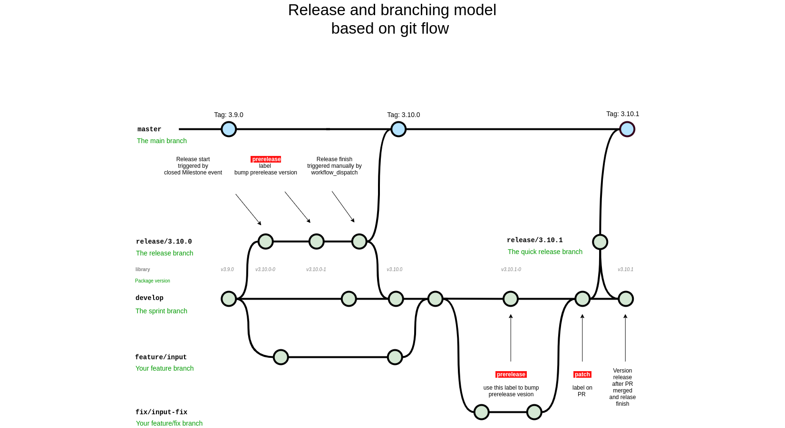

# Release and branching model based on git flow 

## Useful links
=======

# Useful links

- [Git Flow](https://danielkummer.github.io/git-flow-cheatsheet/)
- [git flow support](https://github.com/petervanderdoes/gitflow-avh/wiki/Reference:-git-flow-support)

## Useful links

- [git flow cheatsheet](https://danielkummer.github.io/git-flow-cheatsheet/)
- [git flow support](https://github.com/petervanderdoes/gitflow-avh/wiki/Reference:-git-flow-support)
- [Gitlab Flow as a opportunity](https://docs.gitlab.com/ee/topics/gitlab_flow.html#environment-branches-with-gitlab-flow)
- [Support branches](https://gitversion.net/docs/learn/branching-strategies/gitflow/examples#support-branches)
- [Gitlab Flow](https://docs.gitlab.com/ee/topics/gitlab_flow.html#environment-branches-with-gitlab-flow)
- [Semantic Versioning 2.0.0](https://semver.org/#semantic-versioning-200)
